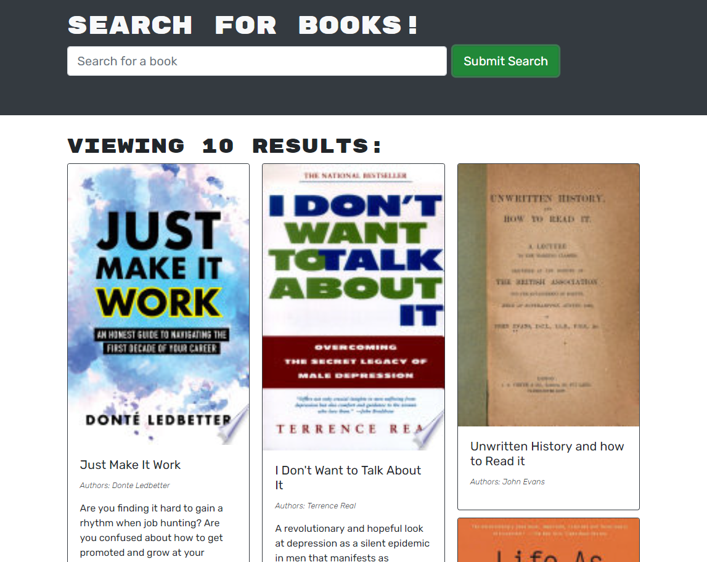

# MERN Book Search Engine

## License

    This project is licensed with MIT.

## Description

This project is a Google Books API search engine built with a GraphQl API built with an Apollo Server. The app was built using the MERN stack with a React front end, MongoDB database, and Node.js/Express.js server and API.

## Table of Contents

1. [License](#license)
2. [Installation](#installation)
3. [Usage](#usage)
4. [Tests](#tests)
5. [Contributing](#contributing)
6. [Questions](#questions)

## Installation

npm i

## Usage

THEN a modal appears on the screen with a toggle between the option to log in or sign up

## Tests

npm run test

## Screenshots: 

## Deployed Link: <https://obscure-atoll-62334.herokuapp.com/>

## Contributing

WHEN I click on the Login/Signup menu option
THEN a modal appears on the screen with a toggle between the option to log in or sign up
WHEN the toggle is set to Signup
THEN I am presented with three inputs for a username, an email address, and a password, and a signup button
WHEN the toggle is set to Login
THEN I am presented with two inputs for an email address and a password and login button
WHEN I enter a valid email address and create a password and click on the signup button
THEN my user account is created and I am logged in to the site
WHEN I enter my account’s email address and password and click on the login button
THEN I the modal closes and I am logged in to the site
WHEN I am logged in to the site
THEN the menu options change to Search for Books, an option to see my saved books, and Logout
WHEN I am logged in and enter a search term in the input field and click the submit button
THEN I am presented with several search results, each featuring a book’s title, author, description, image, and a link to that book on the Google Books site and a button to save a book to my account
WHEN I click on the Save button on a book
THEN that book’s information is saved to my account
WHEN I click on the option to see my saved books
THEN I am presented with all of the books I have saved to my account, each featuring the book’s title, author, description, image, and a link to that book on the Google Books site and a button to remove a book from my account
WHEN I click on the Remove button on a book
THEN that book is deleted from my saved books list
WHEN I click on the Logout button
THEN I am logged out of the site and presented with a menu with the options Search for Books and Login/Signup and an input field to search for books and a submit button

## Questions

Questions?

You may reach me by email at: <eaim928@gmail.com>

You may also reach me on github: <https://github.com/gim928>
